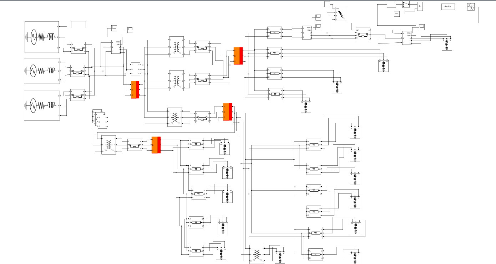
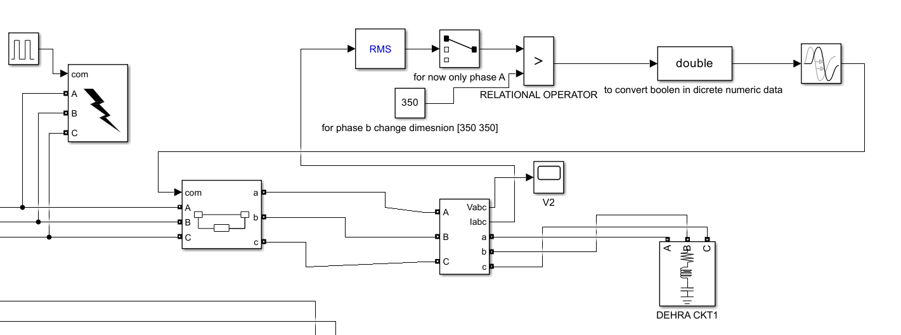
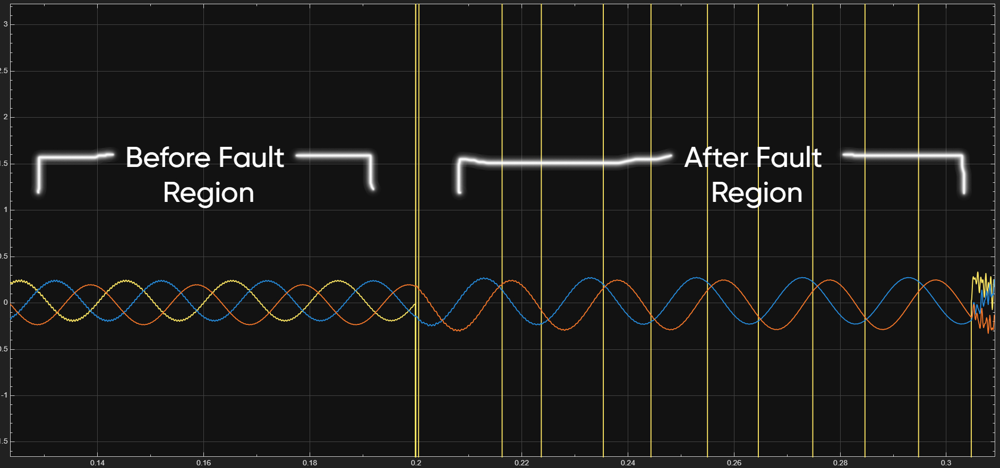
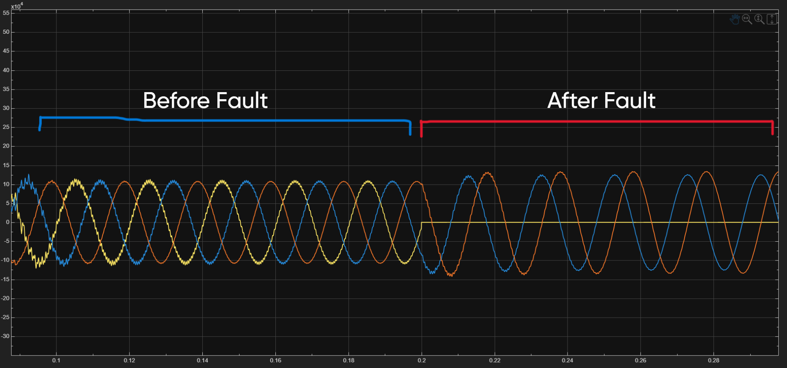

#  220/132/33/11 kV Grid Substation Simulation (HPSEBL Jassure)

##  Project Overview
This project presents a **complete simulation of a 220/132/33/11 kV grid substation** using **MATLAB Simulink & Simscape Electrical (Specialized Power Systems)**.  
The design replicates the real-world configuration of the **HPSEBL Jassure Substation**, including multiple incoming 220 kV lines, step-down transformers, bus couplers, capacitor banks, protective relays, and distribution feeders.  

The model enables **load flow analysis, fault analysis, and switching operations**, showcasing the behavior of an actual extra-high-voltage substation.

---

##  Key Features
-  **Multiple High-Voltage Inputs (220 kV):** Modeled incoming supply from **Pong Dam, Baira Suil, and Ranjeet Sagar Dam**.  
-  **Step-Down Transformers:**  
  - 220/132 kV, 150 MVA transformer bank feeding regional transmission lines.  
  - 220/33 kV, 25/31.5 MVA transformers for medium-voltage distribution.  
  - 33/11 kV, 10 MVA transformers for local distribution.  
-  **Bus Configuration:**  
  - Main & Auxiliary 33 kV busbars with **bus coupler** for redundancy.  
  - Integrated isolators, lightning arresters, CTs, and PTs.  
-  **Load Modeling:** Realistic **P-Q loads** connected at 132 kV, 33 kV, and 11 kV buses.  
-  **Protection System:** Circuit breakers, Buchholz relay, and bus couplers for fault clearing.  
-  **Simulation Capabilities:**  
  - Load flow at multiple voltage levels.  
  - Fault analysis (L-G, L-L, 3-phase faults).  
  - Bus transfer and breaker operation.  

---

##  Tools & Technologies
- **MATLAB Simulink**  
- **Simscape Electrical (Specialized Power Systems)**  
- **Powergui (Load Flow & Fault Analysis)**  

---

##  Outcomes
- Built a **realistic substation model** (220 → 132 → 33 → 11 kV).  
- Simulated **before & after fault waveforms** for voltage and current.  
- Demonstrated **bus transfer reliability** using a bus coupler.  
- Scalable testbed for **renewable energy integration** at 33 kV.  

---

## 📈 Simulation Results
### Simulation Image

### Fault & Relay Circuit

### Current Profile

### Voltage Profile

---

##  Future Enhancements
- Integration of **SCADA-based monitoring**.  
- Addition of **renewable sources (solar/wind) at 33 kV**.  
- Harmonic & stability studies under fault conditions.  

---

##  Author
Developed by **Aryan Choudhary**  
-  B.Tech (Electrical Engineering), NIT Hamirpur  
-  Industrial Training at **HPSEBL (Himachal Pradesh State Electricity Board Ltd.)**  
-  Hands-on experience in **substation operation, transmission, and protection systems**

---

⭐ If you like this project, consider giving it a **star** on GitHub!
